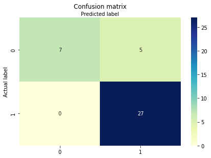
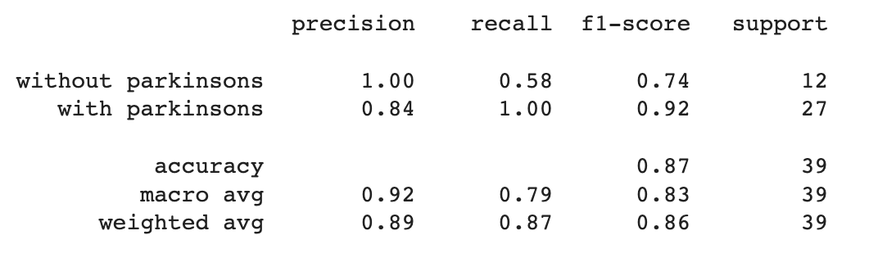
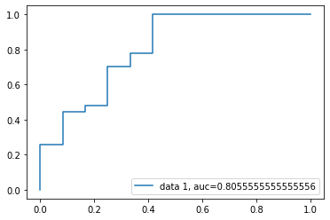

# Parkinsons Disease Prediction using Python
## Multivarite Logistic Regression

Multiple Logistic Regression is a statistical test used to predict a single binary variable using one or more other variables. It also is used to determine the numerical relationship between such a set of variables. The variable you want to predict should be binary and your data should meet the other assumptions listed below.

Parkinson's is a neurological condition that worsens with time. In other words, Parkinson's is a lifelong brain disorder with progressive clinical deterioration. The aim of this project to determine if the patient has Parkinson's disease or not based on observed symptoms and parameters. This dataset includes various biological voice measurements taken from 31 individuals, 23 of whom have Parkinson's disease (PD). Each row in the table represents one of the 195 voice recordings from these people, and each column represents a specific voice measure ("name" column). According to the "status" column, which is set to 0 for healthy and 1 for PD, the primary goal of the data is to distinguish between healthy individuals and those with PD. The main parameters considered for predicting Parkinson’s are MDVP, Shimmer, Jitter, NHR, HNR, RPDE, DFA, D2, PPE. 

## Model building in Scikit-learn
   Python's machine learning algorithm toolkit. Here are some of the tools inside of Sklearn:
•	Linear_model for modeling the logistics regression model
•	Metrics for calculating the accuracies once the model is trained
•	Train_Test_Split for splitting the data into a training and testing data set
   For our model, we get can get the data from: 
   ```
   http://archive.ics.uci.edu/ml/datasets/parkinsons
   ```

## Visualizing Confusion Matrix using Heatmap
```bash
make confusionMatrix
```



## Accuracy of the model
Well, you got a classification rate of 87%, considered as good accuracy.
Precision: Precision is about being precise, i.e., how accurate your model is. In other words, you can say, when a model makes a prediction, how often it is correct. In your prediction case, when your Logistic Regression model predicted, patients are going to suffer from Parkinson’s, that patients have 84% of the time.
Recall: If there are patients who have Parkinson’s in the test set and your Logistic Regression model can identify it 100% of the time.

```bash
make classificationReport
```




## ROC Curve
Receiver Operating Characteristic (ROC) curve is a plot of the true positive rate against the false positive rate. It shows the tradeoff between sensitivity and specificity.

```bash
make regressionmodel
```



AUC score for the case is 0.80. AUC score 1 represents a perfect classifier, and 0.5 represents a worthless classifier.
 

## Conclusion

The goal of this project was to establish data-driven PD progression models, for individual disease identification. I have built a logistic regression model to predict the existence of disease in patients. We used sklearn library to prepare the dataset and build the model. 

## Appendix

The attributes considered for the observation of Parkinson’s disease in patients are listed below:

     x1  MDVP:Fo(Hz)                 Average vocal fundamental frequency   
     x2  MDVP:Fhi(Hz)                Maximum vocal fundamental frequency
     x3  MDVP:Flo(Hz)                Minimum vocal fundamental frequency
     x4  MDVP:Jitter                 Measure of variation in fundamental frequency
     x5   MDVP:Jitter(Abs)           Measure of variation in fundamental frequency
     x6  MDVP:RAP                    Measure of variation in fundamental frequency
     x7  MDVP:PPQ                    Measure of variation in fundamental frequency
     x8  Jitter:DDP                  Measure of variation in fundamental frequency
     x9  MDVP:Shimmer                Measure of variation in amplitude
     x10 MDVP:Shimmer(dB)            Measure of variation in amplitude
     x11 Shimmer:APQ3                Measure of variation in amplitude
     x12 Shimmer:APQ5                Measure of variation in amplitude
     x13 MDVP:APQ                    Measure of variation in amplitude
     x14 Shimmer:DDA                 Measure of variation in amplitude
     x15 NHR                         Measure of the ratio of noise to tonal components in the voice
     x16 HNR                         Measure of the ratio of noise to tonal components in the voice
     x17 RPDE                        Nonlinear dynamical complexity measure
     x18 DFA                         Signal fractal scaling exponent
     x19 spread1                     Nonlinear measure of fundamental frequency variation
     x20 spread2                     Nonlinear measure of fundamental frequency variation
     x21 D2                          Nonlinear dynamical complexity measure
     x22 PPE                         Nonlinear measure of fundamental frequency variation

## References
  
https://briangrant.org/parkinsons-overview/?gclid=CjwKCAiA7IGcBhA8EiwAFfUDsXipHdSHlHHpUu9S7EWFCBhdxYu_jHid3bcnjZBGphzFcxnNr7rA4BoC4qcQAvD_BwE
https://www.indeed.com/career-advice/career-development/multivariate-logistic-regression
https://www.sciencedirect.com/topics/medicine-and-dentistry/multivariate-logistic-regression-analysis
https://realpython.com/logistic-regression-python/
https://www.datacamp.com/tutorial/understanding-logistic-regression-python


